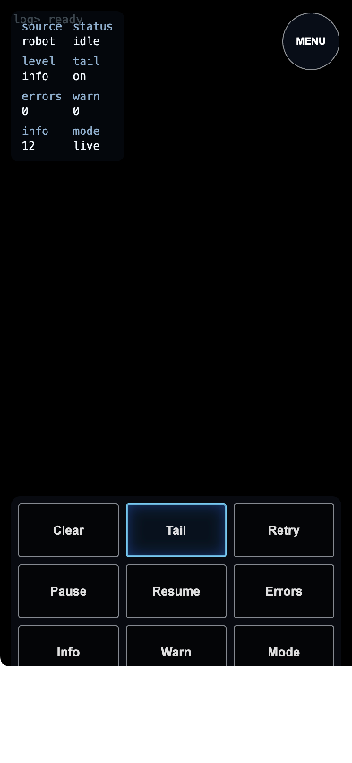

# UI Plugin src_v1 Test Report

<!-- ATTACH_METADATA_START -->
```yaml
chrome_hostnode: chroma
chrome_count_before: 87
chrome_count_after: 87
```
<!-- ATTACH_METADATA_END -->


**Generated at:** Fri, 27 Feb 2026 18:58:13 -0800
**Version:** `ui-src-v1`
**Runner:** `test/src_v1`
**Status:** ✅ PASS
**Total Time:** `6.286751593s`

## Test Steps

| Step | Result | Duration |
|---|---|---|
| ui-quality-fmt-lint-build | ✅ PASS | `2.220064772s` |
| ui-build-and-go-serve | ✅ PASS | `4.056446124s` |
| ui-section-hero-via-menu | ✅ PASS | `2.192959ms` |
| ui-section-three-fullscreen-via-menu | ✅ PASS | `1.137325ms` |
| ui-section-three-calculator-via-menu | ✅ PASS | `960.439µs` |
| ui-section-table-via-menu | ✅ PASS | `1.39504ms` |
| ui-section-camera-via-menu | ✅ PASS | `1.41477ms` |
| ui-section-docs-via-menu | ✅ PASS | `991.774µs` |
| ui-section-terminal-via-menu | ✅ PASS | `812.933µs` |
| ui-section-settings-via-menu | ✅ PASS | `1.30496ms` |

## Step Details

## ui-quality-fmt-lint-build

### Results

```text
result: PASS
duration: 2.220064772s
report: fmt-check, lint, and build passed
```

### Logs

```text
logs:
INFO: running command: /home/user/dialtone/dialtone.sh ui src_v1 install
INFO: stdout: >> Running: /home/user/dialtone_dependencies/bun/bin/bun install (in /home/user/dialtone/src/plugins/ui/src_v1/test/fixtures/app)
INFO: stdout: bun install v1.3.9 (cf6cdbbb)
INFO: stdout: Checked 22 installs across 69 packages (no changes) [1.00ms]
INFO: stderr: <empty>
INFO: running command: /home/user/dialtone/dialtone.sh ui src_v1 fmt-check
INFO: stdout: >> Running: /home/user/dialtone_dependencies/bun/bin/bun run fmt:check (in /home/user/dialtone/src/plugins/ui/src_v1/test/fixtures/app)
INFO: stdout: Checking formatting...
INFO: stdout: All matched files use Prettier code style!
INFO: stderr: $ prettier --check .
INFO: running command: /home/user/dialtone/dialtone.sh ui src_v1 lint
INFO: stdout: >> Running: /home/user/dialtone_dependencies/bun/bin/bun run lint (in /home/user/dialtone/src/plugins/ui/src_v1/test/fixtures/app)
INFO: stderr: $ tsc --noEmit
INFO: running command: /home/user/dialtone/dialtone.sh ui src_v1 build
INFO: stdout: >> Running: /home/user/dialtone_dependencies/bun/bin/bun run build (in /home/user/dialtone/src/plugins/ui/src_v1/test/fixtures/app)
INFO: stdout: vite v5.4.21 building for production...
INFO: stdout: transforming...
INFO: stdout: ✓ 12 modules transformed.
INFO: stdout: rendering chunks...
INFO: stdout: computing gzip size...
INFO: stdout: dist/index.html                   1.56 kB │ gzip:   0.47 kB
INFO: stdout: dist/assets/index-DU0jfcrJ.css   13.13 kB │ gzip:   3.51 kB
INFO: stdout: dist/assets/index-ZGf0pex0.js   510.71 kB │ gzip: 130.26 kB
INFO: stdout: ✓ built in 698ms
INFO: stderr: $ vite build
INFO: stderr: (!) Some chunks are larger than 500 kB after minification. Consider:
INFO: stderr: - Using dynamic import() to code-split the application
INFO: stderr: - Use build.rollupOptions.output.manualChunks to improve chunking: https://rollupjs.org/configuration-options/#output-manualchunks
INFO: stderr: - Adjust chunk size limit for this warning via build.chunkSizeWarningLimit.
INFO: report: fmt-check, lint, and build passed
PASS: [TEST][PASS] [STEP:ui-quality-fmt-lint-build] report: fmt-check, lint, and build passed
```

### Browser Logs

```text
browser_logs:
<empty>
```

## ui-build-and-go-serve

### Results

```text
result: PASS
duration: 4.056446124s
report: fixture served and attached browser session is ready
```

### Injected Browser Error Check

```text
WARN: INJECTED_BROWSER_CHECK: skipped (remote browser mode)
```

### Logs

```text
logs:
INFO: STEP> begin ui-build-and-go-serve
INFO: LOOKING FOR: persistent ui dev server already running at http://127.0.0.1:5177
WARN: INJECTED_BROWSER_CHECK: skipped (remote browser mode)
INFO: saved browser debug config: /home/user/dialtone/src/plugins/ui/src_v1/test/browser.debug.json
INFO: report: fixture served and attached browser session is ready
PASS: [TEST][PASS] [STEP:ui-build-and-go-serve] report: fixture served and attached browser session is ready
```

### Browser Logs

```text
browser_logs:
<empty>
```

### Screenshots


## ui-section-hero-via-menu

### Results

```text
result: PASS
duration: 2.192959ms
report: section hero attach setup verified
```

### Logs

```text
logs:
INFO: STEP> begin ui-section-hero-via-menu
INFO: LOOKING FOR: persistent ui dev server already running at http://127.0.0.1:5177
INFO: report: section hero attach setup verified
PASS: [TEST][PASS] [STEP:ui-section-hero-via-menu] report: section hero attach setup verified
```

### Browser Logs

```text
browser_logs:
<empty>
```

### Screenshots


## ui-section-three-fullscreen-via-menu

### Results

```text
result: PASS
duration: 1.137325ms
report: section three-fullscreen attach setup verified
```

### Logs

```text
logs:
INFO: STEP> begin ui-section-three-fullscreen-via-menu
INFO: LOOKING FOR: persistent ui dev server already running at http://127.0.0.1:5177
INFO: report: section three-fullscreen attach setup verified
PASS: [TEST][PASS] [STEP:ui-section-three-fullscreen-via-menu] report: section three-fullscreen attach setup verified
```

### Browser Logs

```text
browser_logs:
<empty>
```

### Screenshots


## ui-section-three-calculator-via-menu

### Results

```text
result: PASS
duration: 960.439µs
report: section three-calculator attach setup verified
```

### Logs

```text
logs:
INFO: STEP> begin ui-section-three-calculator-via-menu
INFO: LOOKING FOR: persistent ui dev server already running at http://127.0.0.1:5177
INFO: report: section three-calculator attach setup verified
PASS: [TEST][PASS] [STEP:ui-section-three-calculator-via-menu] report: section three-calculator attach setup verified
```

### Browser Logs

```text
browser_logs:
<empty>
```

### Screenshots


## ui-section-table-via-menu

### Results

```text
result: PASS
duration: 1.39504ms
report: section table attach setup verified
```

### Logs

```text
logs:
INFO: STEP> begin ui-section-table-via-menu
INFO: LOOKING FOR: persistent ui dev server already running at http://127.0.0.1:5177
INFO: report: section table attach setup verified
PASS: [TEST][PASS] [STEP:ui-section-table-via-menu] report: section table attach setup verified
```

### Browser Logs

```text
browser_logs:
<empty>
```

### Screenshots


## ui-section-camera-via-menu

### Results

```text
result: PASS
duration: 1.41477ms
report: section camera attach setup verified
```

### Logs

```text
logs:
INFO: STEP> begin ui-section-camera-via-menu
INFO: LOOKING FOR: persistent ui dev server already running at http://127.0.0.1:5177
INFO: report: section camera attach setup verified
PASS: [TEST][PASS] [STEP:ui-section-camera-via-menu] report: section camera attach setup verified
```

### Browser Logs

```text
browser_logs:
<empty>
```

### Screenshots


## ui-section-docs-via-menu

### Results

```text
result: PASS
duration: 991.774µs
report: section docs attach setup verified
```

### Logs

```text
logs:
INFO: STEP> begin ui-section-docs-via-menu
INFO: LOOKING FOR: persistent ui dev server already running at http://127.0.0.1:5177
INFO: report: section docs attach setup verified
PASS: [TEST][PASS] [STEP:ui-section-docs-via-menu] report: section docs attach setup verified
```

### Browser Logs

```text
browser_logs:
<empty>
```

### Screenshots


## ui-section-terminal-via-menu

### Results

```text
result: PASS
duration: 812.933µs
report: section terminal attach setup verified
```

### Logs

```text
logs:
INFO: STEP> begin ui-section-terminal-via-menu
INFO: LOOKING FOR: persistent ui dev server already running at http://127.0.0.1:5177
INFO: report: section terminal attach setup verified
PASS: [TEST][PASS] [STEP:ui-section-terminal-via-menu] report: section terminal attach setup verified
```

### Browser Logs

```text
browser_logs:
<empty>
```

### Screenshots



## ui-section-settings-via-menu

### Results

```text
result: PASS
duration: 1.30496ms
report: section settings attach setup verified
```

### Logs

```text
logs:
INFO: STEP> begin ui-section-settings-via-menu
INFO: LOOKING FOR: persistent ui dev server already running at http://127.0.0.1:5177
INFO: report: section settings attach setup verified
PASS: [TEST][PASS] [STEP:ui-section-settings-via-menu] report: section settings attach setup verified
```

### Browser Logs

```text
browser_logs:
<empty>
```

### Screenshots


