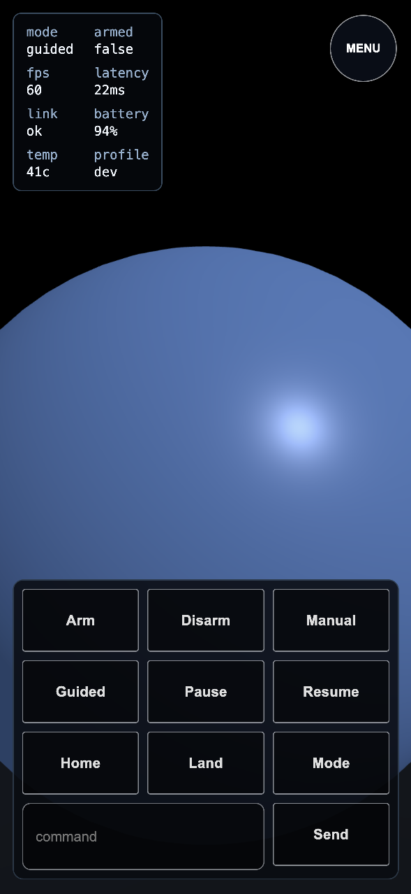
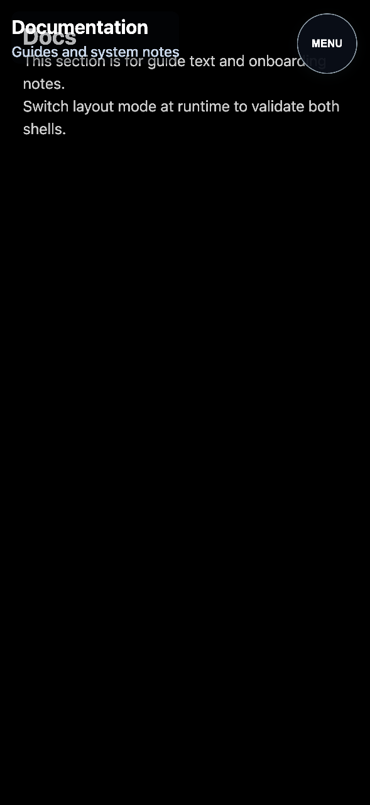
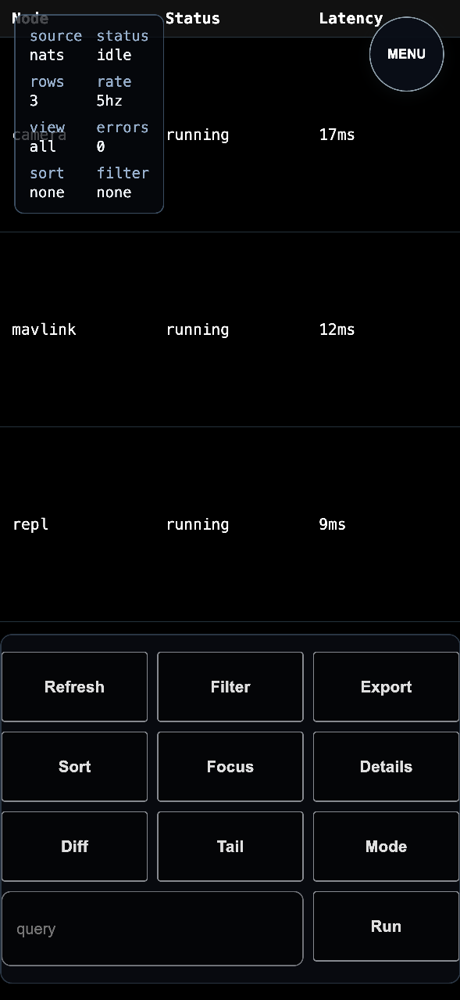
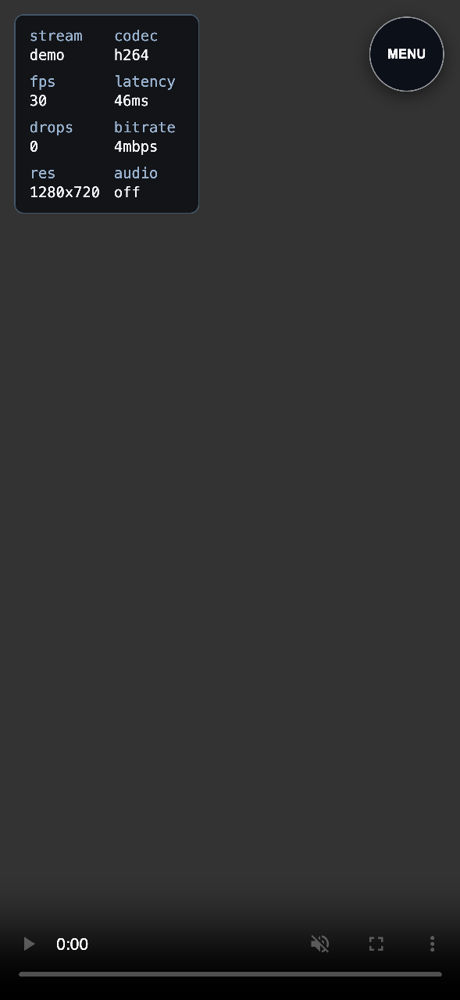
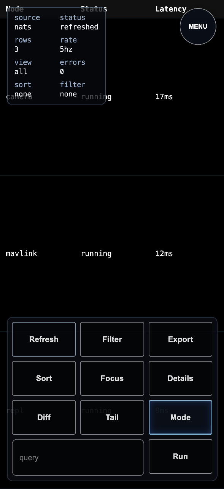
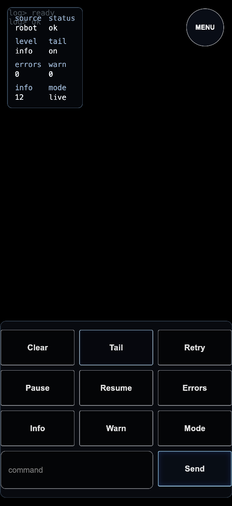
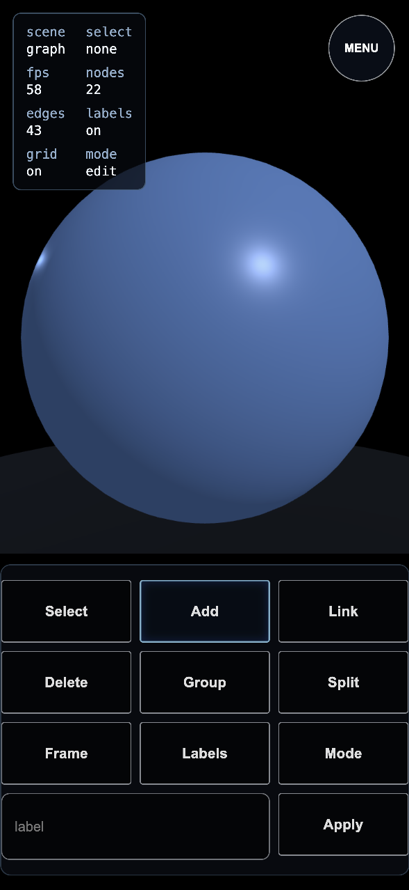

# Test Report: ui-src-v1

- **Date**: Fri, 27 Feb 2026 13:54:58 PST
- **Total Duration**: 17.035057518s

## Summary

- **Steps**: 4 / 4 passed
- **Status**: PASSED

## Details

### 1. ✅ ui-quality-fmt-lint-build

- **Duration**: 2.194752507s
- **Report**: fmt-check, lint, and build passed

#### Logs

```text
INFO: running command: /home/user/dialtone/dialtone.sh ui src_v1 install
INFO: stdout: >> Running: /home/user/dialtone_dependencies/bun/bin/bun install (in /home/user/dialtone/src/plugins/ui/src_v1/test/fixtures/app)
INFO: stdout: bun install v1.3.9 (cf6cdbbb)
INFO: stdout: Checked 22 installs across 69 packages (no changes) [2.00ms]
INFO: stderr: <empty>
INFO: running command: /home/user/dialtone/dialtone.sh ui src_v1 fmt-check
INFO: stdout: >> Running: /home/user/dialtone_dependencies/bun/bin/bun run fmt:check (in /home/user/dialtone/src/plugins/ui/src_v1/test/fixtures/app)
INFO: stdout: Checking formatting...
INFO: stdout: All matched files use Prettier code style!
INFO: stderr: $ prettier --check .
INFO: running command: /home/user/dialtone/dialtone.sh ui src_v1 lint
INFO: stdout: >> Running: /home/user/dialtone_dependencies/bun/bin/bun run lint (in /home/user/dialtone/src/plugins/ui/src_v1/test/fixtures/app)
INFO: stderr: $ tsc --noEmit
INFO: running command: /home/user/dialtone/dialtone.sh ui src_v1 build
INFO: stdout: >> Running: /home/user/dialtone_dependencies/bun/bin/bun run build (in /home/user/dialtone/src/plugins/ui/src_v1/test/fixtures/app)
INFO: stdout: vite v5.4.21 building for production...
INFO: stdout: transforming...
INFO: stdout: ✓ 12 modules transformed.
INFO: stdout: rendering chunks...
INFO: stdout: computing gzip size...
INFO: stdout: dist/index.html                   1.56 kB │ gzip:   0.47 kB
INFO: stdout: dist/assets/index-DajVPu_L.css   13.19 kB │ gzip:   3.53 kB
INFO: stdout: dist/assets/index-BXDP4L3t.js   511.08 kB │ gzip: 130.40 kB
INFO: stdout: ✓ built in 649ms
INFO: stderr: $ vite build
INFO: stderr: (!) Some chunks are larger than 500 kB after minification. Consider:
INFO: stderr: - Using dynamic import() to code-split the application
INFO: stderr: - Use build.rollupOptions.output.manualChunks to improve chunking: https://rollupjs.org/configuration-options/#output-manualchunks
INFO: stderr: - Adjust chunk size limit for this warning via build.chunkSizeWarningLimit.
INFO: report: fmt-check, lint, and build passed
PASS: [TEST][PASS] [STEP:ui-quality-fmt-lint-build] report: fmt-check, lint, and build passed
```

#### Browser Logs

```text
<empty>
```

---

### 2. ✅ ui-build-and-go-serve

- **Duration**: 8.632649728s
- **Report**: fixture built, hero section loaded, legend header verified (attach=true)

#### Logs

```text
INFO: STEP> begin ui-build-and-go-serve
INFO: LOOKING FOR: ui fixture build at /home/user/dialtone/src/plugins/ui/src_v1/test/fixtures/app
INFO: LOOKING FOR: [/home/user/dialtone_dependencies/bun/bin/bun install --silent]
INFO: LOOKING FOR: [/home/user/dialtone_dependencies/bun/bin/bun run build]
INFO: LOOKING FOR: go ui backend at http://127.0.0.1:41879
INFO: report: fixture built, hero section loaded, legend header verified (attach=true)
PASS: [TEST][PASS] [STEP:ui-build-and-go-serve] report: fixture built, hero section loaded, legend header verified (attach=true)
```

#### Browser Logs

```text
<empty>
```

#### Screenshots



---

### 3. ✅ ui-section-navigation-via-menu

- **Duration**: 3.519554121s
- **Report**: menu navigation verified for docs/table/three-fullscreen/camera/settings with screenshots

#### Logs

```text
INFO: STEP> begin ui-section-navigation-via-menu
INFO: report: menu navigation verified for docs/table/three-fullscreen/camera/settings with screenshots
PASS: [TEST][PASS] [STEP:ui-section-navigation-via-menu] report: menu navigation verified for docs/table/three-fullscreen/camera/settings with screenshots
```

#### Browser Logs

```text
INFO: CONSOLE:log: "[TEST_ACTION] click aria=Toggle Global Menu"
INFO: CONSOLE:log: "[TEST_ACTION] click aria=Navigate Docs"
INFO: CONSOLE:log: "[SectionManager] NAVIGATING TO #docs"
INFO: CONSOLE:log: "[SectionManager] LOADING #docs"
INFO: CONSOLE:log: "[SectionManager] ctl.load() RESOLVED for #docs"
INFO: CONSOLE:log: "[SectionManager] LOADED #docs"
INFO: CONSOLE:log: "[SectionManager] START #docs"
INFO: CONSOLE:log: "[SectionManager] Setting data-ready=true on #docs"
INFO: CONSOLE:log: "[SectionManager] NAVIGATE AWAY #hero"
INFO: CONSOLE:log: "[SectionManager] PAUSE #hero"
INFO: CONSOLE:log: "[SectionManager] NAVIGATE TO #docs"
INFO: CONSOLE:log: "[SectionManager] RESUME #docs"
INFO: CONSOLE:log: "[TEST_ACTION] click aria=Toggle Global Menu"
INFO: CONSOLE:log: "[TEST_ACTION] click aria=Navigate Table"
INFO: CONSOLE:log: "[SectionManager] NAVIGATING TO #table"
INFO: CONSOLE:log: "[SectionManager] LOADING #table"
INFO: CONSOLE:log: "[SectionManager] ctl.load() RESOLVED for #table"
INFO: CONSOLE:log: "[SectionManager] LOADED #table"
INFO: CONSOLE:log: "[SectionManager] START #table"
INFO: CONSOLE:log: "[SectionManager] Setting data-ready=true on #table"
INFO: CONSOLE:log: "[SectionManager] NAVIGATE AWAY #docs"
INFO: CONSOLE:log: "[SectionManager] PAUSE #docs"
INFO: CONSOLE:log: "[SectionManager] NAVIGATE TO #table"
INFO: CONSOLE:log: "[SectionManager] RESUME #table"
INFO: CONSOLE:log: "[TEST_ACTION] click aria=Toggle Global Menu"
INFO: CONSOLE:log: "[TEST_ACTION] click aria=Navigate Three Fullscreen"
INFO: CONSOLE:log: "[SectionManager] NAVIGATING TO #three-fullscreen"
INFO: CONSOLE:log: "[SectionManager] LOADING #three-fullscreen"
INFO: CONSOLE:log: "[SectionManager] ctl.load() RESOLVED for #three-fullscreen"
INFO: CONSOLE:log: "[SectionManager] LOADED #three-fullscreen"
INFO: CONSOLE:log: "[SectionManager] START #three-fullscreen"
INFO: CONSOLE:log: "[SectionManager] Setting data-ready=true on #three-fullscreen"
INFO: CONSOLE:log: "[SectionManager] NAVIGATE AWAY #table"
INFO: CONSOLE:log: "[SectionManager] PAUSE #table"
INFO: CONSOLE:log: "[SectionManager] NAVIGATE TO #three-fullscreen"
INFO: CONSOLE:log: "[SectionManager] RESUME #three-fullscreen"
INFO: CONSOLE:log: "[TEST_ACTION] click aria=Toggle Global Menu"
INFO: CONSOLE:log: "[TEST_ACTION] click aria=Navigate Camera"
INFO: CONSOLE:log: "[SectionManager] NAVIGATING TO #camera"
INFO: CONSOLE:log: "[SectionManager] LOADING #camera"
INFO: CONSOLE:log: "[SectionManager] ctl.load() RESOLVED for #camera"
INFO: CONSOLE:log: "[SectionManager] LOADED #camera"
INFO: CONSOLE:log: "[SectionManager] START #camera"
INFO: CONSOLE:log: "[SectionManager] Setting data-ready=true on #camera"
INFO: CONSOLE:log: "[SectionManager] NAVIGATE AWAY #three-fullscreen"
INFO: CONSOLE:log: "[SectionManager] PAUSE #three-fullscreen"
INFO: CONSOLE:log: "[SectionManager] NAVIGATE TO #camera"
INFO: CONSOLE:log: "[SectionManager] RESUME #camera"
INFO: CONSOLE:log: "[TEST_ACTION] click aria=Toggle Global Menu"
INFO: CONSOLE:log: "[TEST_ACTION] click aria=Navigate Settings"
INFO: CONSOLE:log: "[SectionManager] NAVIGATING TO #settings"
INFO: CONSOLE:log: "[SectionManager] LOADING #settings"
INFO: CONSOLE:log: "[SectionManager] ctl.load() RESOLVED for #settings"
INFO: CONSOLE:log: "[SectionManager] LOADED #settings"
INFO: CONSOLE:log: "[SectionManager] START #settings"
INFO: CONSOLE:log: "[SectionManager] Setting data-ready=true on #settings"
INFO: CONSOLE:log: "[SectionManager] NAVIGATE AWAY #camera"
INFO: CONSOLE:log: "[SectionManager] PAUSE #camera"
INFO: CONSOLE:log: "[SectionManager] NAVIGATE TO #settings"
INFO: CONSOLE:log: "[SectionManager] RESUME #settings"
```

#### Screenshots







---

### 4. ✅ ui-component-actions-and-modes

- **Duration**: 2.68808145s
- **Report**: component actions verified (mode toggle, table refresh, terminal send, three add) with mobile screenshots

#### Logs

```text
INFO: STEP> begin ui-component-actions-and-modes
INFO: report: component actions verified (mode toggle, table refresh, terminal send, three add) with mobile screenshots
PASS: [TEST][PASS] [STEP:ui-component-actions-and-modes] report: component actions verified (mode toggle, table refresh, terminal send, three add) with mobile screenshots
```

#### Browser Logs

```text
INFO: CONSOLE:log: "[SectionManager] NAVIGATING TO #table"
INFO: CONSOLE:log: "[SectionManager] NAVIGATE AWAY #settings"
INFO: CONSOLE:log: "[SectionManager] PAUSE #settings"
INFO: CONSOLE:log: "[SectionManager] NAVIGATE TO #table"
INFO: CONSOLE:log: "[SectionManager] RESUME #table"
INFO: CONSOLE:log: "table-refreshed"
INFO: CONSOLE:log: "mode-toggle:table:fullscreen"
INFO: CONSOLE:log: "[TEST_ACTION] click aria=Toggle Global Menu"
INFO: CONSOLE:log: "[TEST_ACTION] click aria=Navigate Terminal"
INFO: CONSOLE:log: "[SectionManager] NAVIGATING TO #terminal"
INFO: CONSOLE:log: "[SectionManager] LOADING #terminal"
INFO: CONSOLE:log: "[SectionManager] ctl.load() RESOLVED for #terminal"
INFO: CONSOLE:log: "[SectionManager] LOADED #terminal"
INFO: CONSOLE:log: "[SectionManager] START #terminal"
INFO: CONSOLE:log: "[SectionManager] Setting data-ready=true on #terminal"
INFO: CONSOLE:log: "[SectionManager] NAVIGATE AWAY #table"
INFO: CONSOLE:log: "[SectionManager] PAUSE #table"
INFO: CONSOLE:log: "[SectionManager] NAVIGATE TO #terminal"
INFO: CONSOLE:log: "[SectionManager] RESUME #terminal"
INFO: CONSOLE:log: "log-submit:ok"
INFO: CONSOLE:log: "[TEST_ACTION] click aria=Toggle Global Menu"
INFO: CONSOLE:log: "[TEST_ACTION] click aria=Navigate Three Calculator"
INFO: CONSOLE:log: "[SectionManager] NAVIGATING TO #three-calculator"
INFO: CONSOLE:log: "[SectionManager] LOADING #three-calculator"
INFO: CONSOLE:log: "[SectionManager] ctl.load() RESOLVED for #three-calculator"
INFO: CONSOLE:log: "[SectionManager] LOADED #three-calculator"
INFO: CONSOLE:log: "[SectionManager] START #three-calculator"
INFO: CONSOLE:log: "[SectionManager] Setting data-ready=true on #three-calculator"
INFO: CONSOLE:log: "[SectionManager] NAVIGATE AWAY #terminal"
INFO: CONSOLE:log: "[SectionManager] PAUSE #terminal"
INFO: CONSOLE:log: "[SectionManager] NAVIGATE TO #three-calculator"
INFO: CONSOLE:log: "[SectionManager] RESUME #three-calculator"
INFO: CONSOLE:log: "three-add:1"
```

#### Screenshots





---

