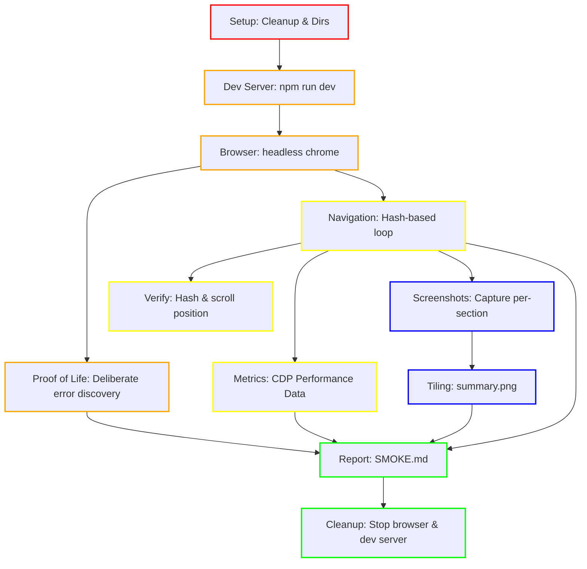
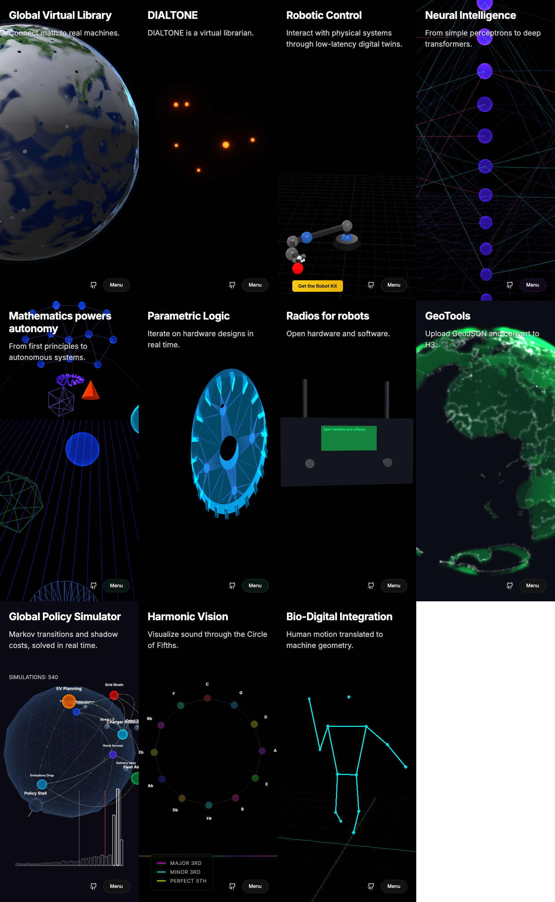

# WWW Plugin Smoke Test Report

**Generated at:** Thu, 12 Feb 2026 10:59:39 PST

## 1. Expected Errors (Proof of Life)

| Level | Message | Status |
|---|---|---|
| error | "[PROOFOFLIFE] Intentional Browser Test Error" | ✅ CAPTURED |
| error | [PROOFOFLIFE] Intentional Go Test Error | ✅ CAPTURED |

## 2. Real Errors & Warnings

### [warning] 
```
"[main] ❌ loadSection failed: # not found or not a slide"

Stack Trace:
  loadSection (http://127.0.0.1:5173/src/main.ts:148:10)
   (http://127.0.0.1:5173/src/main.ts:151:5)

```

## 3. Performance Metrics

| Section | FPS | App CPU (ms) | App GPU (ms) | JS Heap (MB) | Resources (MB) | Status |
|---|---|---|---|---|---|---|
| s-home | 60 | 0.37 | 0.12 | 0.00 | 0.00 | OK |
| s-about | 62 | 1.11 | 3.15 | 0.00 | 0.00 | OK |
| s-robot | 60 | 0.70 | 0.02 | 0.00 | 0.00 | OK |
| s-neural | 63 | 1.09 | 0.02 | 0.00 | 0.00 | OK |
| s-math | 60 | 0.82 | 0.02 | 0.00 | 0.00 | OK |
| s-cad | 62 | 0.26 | 0.06 | 0.00 | 0.00 | OK |
| s-radio | 35 | 0.65 | 0.07 | 0.00 | 0.00 | OK |
| s-geotools | 61 | 0.28 | 0.08 | 0.00 | 0.00 | OK |
| s-docs | 61 | 0.22 | 0.01 | 0.00 | 0.00 | OK |
| s-policy | 61 | 0.58 | 0.17 | 0.00 | 0.00 | OK |
| s-music | 2 | 0.65 | 0.28 | 0.00 | 0.00 | OK |
| s-webgpu-template | 60 | 0.22 | 0.15 | 0.00 | 0.00 | OK |
| s-threejs-template | 60 | 0.21 | 0.01 | 0.00 | 0.00 | OK |

## 4. Test Orchestration DAG

### Legend
| Layer | Color | Description |
|---|---|---|
| **1. Foundation** | <span style="color:red">█</span> Red | Cleanup, environment, and directory setup. |
| **2. Core Logic** | <span style="color:orange">█</span> Orange | Dev server, browser initialization, and proof-of-life. |
| **3. Features** | <span style="color:yellow">█</span> Yellow | Navigation loop, verification, and metrics capture. |
| **4. QA** | <span style="color:blue">█</span> Blue | Screenshot capture and visual summary tiling. |
| **5. Release** | <span style="color:green">█</span> Green | Final report generation and process cleanup. |



## 5. Visual Summary Grid

