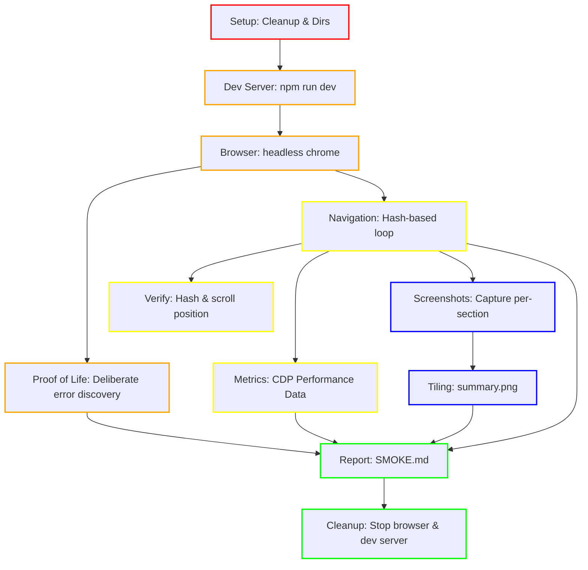

# WWW Plugin Smoke Test Report

**Generated at:** Sat, 07 Feb 2026 14:49:04 PST

## 1. Expected Errors (Proof of Life)

| Level | Message | Status |
|---|---|---|
| error | "[PROOFOFLIFE] Intentional Browser Test Error" | ✅ CAPTURED |
| error | [PROOFOFLIFE] Intentional Go Test Error | ✅ CAPTURED |
| log | "[PROOFOFLIFE] 📸 SCREENSHOT STARTING: s-home" | ✅ CAPTURED |
| log | "[PROOFOFLIFE] 📸 SCREENSHOT STARTING: s-about" | ✅ CAPTURED |
| log | "[PROOFOFLIFE] 📸 SCREENSHOT STARTING: s-neural" | ✅ CAPTURED |
| log | "[PROOFOFLIFE] 📸 SCREENSHOT STARTING: s-math" | ✅ CAPTURED |
| log | "[PROOFOFLIFE] 📸 SCREENSHOT STARTING: s-radio" | ✅ CAPTURED |
| log | "[PROOFOFLIFE] 📸 SCREENSHOT STARTING: s-geotools" | ✅ CAPTURED |
| log | "[PROOFOFLIFE] 📸 SCREENSHOT STARTING: s-robot" | ✅ CAPTURED |
| log | "[PROOFOFLIFE] 📸 SCREENSHOT STARTING: s-cad" | ✅ CAPTURED |
| log | "[PROOFOFLIFE] 📸 SCREENSHOT STARTING: s-docs" | ✅ CAPTURED |
| log | "[PROOFOFLIFE] 📸 SCREENSHOT STARTING: s-webgpu-template" | ✅ CAPTURED |
| log | "[PROOFOFLIFE] 📸 SCREENSHOT STARTING: s-threejs-template" | ✅ CAPTURED |

## 2. Real Errors & Warnings

### [warning] 
```
"[main] ❌ loadSection failed: # not found or not a slide"

Stack Trace:
  loadSection (http://127.0.0.1:5173/src/main.ts:130:10)
   (http://127.0.0.1:5173/src/main.ts:133:5)

```

### [log] s-home
```
"%c[main] 🔁 SWAP: #s-home" "color: #8b5cf6; font-weight: bold"

Stack Trace:
  loadSection (http://127.0.0.1:5173/src/main.ts:112:12)
   (http://127.0.0.1:5173/src/main.ts:139:2)

```

### [log] s-about
```
"%c[main] 🔁 SWAP: #s-about" "color: #8b5cf6; font-weight: bold"

Stack Trace:
  loadSection (http://127.0.0.1:5173/src/main.ts:112:12)
   (http://127.0.0.1:5173/src/main.ts:139:2)

```

### [log] s-neural
```
"%c[main] 🔁 SWAP: #s-neural" "color: #8b5cf6; font-weight: bold"

Stack Trace:
  loadSection (http://127.0.0.1:5173/src/main.ts:112:12)
   (http://127.0.0.1:5173/src/main.ts:139:2)

```

### [log] s-math
```
"%c[main] 🔁 SWAP: #s-math" "color: #8b5cf6; font-weight: bold"

Stack Trace:
  loadSection (http://127.0.0.1:5173/src/main.ts:112:12)
   (http://127.0.0.1:5173/src/main.ts:139:2)

```

### [log] s-cad
```
"%c[main] 🔁 SWAP: #s-cad" "color: #8b5cf6; font-weight: bold"

Stack Trace:
  loadSection (http://127.0.0.1:5173/src/main.ts:112:12)
   (http://127.0.0.1:5173/src/main.ts:139:2)

```

### [log] s-webgpu-template
```
"%c[main] 🔁 SWAP: #s-webgpu-template" "color: #8b5cf6; font-weight: bold"

Stack Trace:
  loadSection (http://127.0.0.1:5173/src/main.ts:112:12)
   (http://127.0.0.1:5173/src/main.ts:139:2)

```

### [log] s-robot
```
"%c[main] 🔁 SWAP: #s-robot" "color: #8b5cf6; font-weight: bold"

Stack Trace:
  loadSection (http://127.0.0.1:5173/src/main.ts:112:12)
   (http://127.0.0.1:5173/src/main.ts:139:2)

```

### [log] s-radio
```
"%c[main] 🔁 SWAP: #s-radio" "color: #8b5cf6; font-weight: bold"

Stack Trace:
  loadSection (http://127.0.0.1:5173/src/main.ts:112:12)
   (http://127.0.0.1:5173/src/main.ts:139:2)

```

### [log] s-geotools
```
"%c[main] 🔁 SWAP: #s-geotools" "color: #8b5cf6; font-weight: bold"

Stack Trace:
  loadSection (http://127.0.0.1:5173/src/main.ts:112:12)
   (http://127.0.0.1:5173/src/main.ts:139:2)

```

### [log] s-docs
```
"%c[main] 🔁 SWAP: #s-docs" "color: #8b5cf6; font-weight: bold"

Stack Trace:
  loadSection (http://127.0.0.1:5173/src/main.ts:112:12)
   (http://127.0.0.1:5173/src/main.ts:139:2)

```

### [log] s-threejs-template
```
"%c[main] 🔁 SWAP: #s-threejs-template" "color: #8b5cf6; font-weight: bold"

Stack Trace:
  loadSection (http://127.0.0.1:5173/src/main.ts:112:12)
   (http://127.0.0.1:5173/src/main.ts:139:2)

```

## 3. Performance Metrics

| Section | JS Heap (MB) | Resources (MB) | Status |
|---|---|---|---|
| s-home | 0.00 | 0.00 | OK |
| s-about | 0.00 | 0.00 | OK |
| s-robot | 0.00 | 0.00 | OK |
| s-neural | 0.00 | 0.00 | OK |
| s-math | 0.00 | 0.00 | OK |
| s-cad | 0.00 | 0.00 | OK |
| s-radio | 0.00 | 0.00 | OK |
| s-geotools | 0.00 | 0.00 | OK |
| s-docs | 0.00 | 0.00 | OK |
| s-webgpu-template | 0.00 | 0.00 | OK |
| s-threejs-template | 0.00 | 0.00 | OK |

## 4. Test Orchestration DAG

### Legend
| Layer | Color | Description |
|---|---|---|
| **1. Foundation** | <span style="color:red">█</span> Red | Cleanup, environment, and directory setup. |
| **2. Core Logic** | <span style="color:orange">█</span> Orange | Dev server, browser initialization, and proof-of-life. |
| **3. Features** | <span style="color:yellow">█</span> Yellow | Navigation loop, verification, and metrics capture. |
| **4. QA** | <span style="color:blue">█</span> Blue | Screenshot capture and visual summary tiling. |
| **5. Release** | <span style="color:green">█</span> Green | Final report generation and process cleanup. |



## 5. Visual Summary Grid

