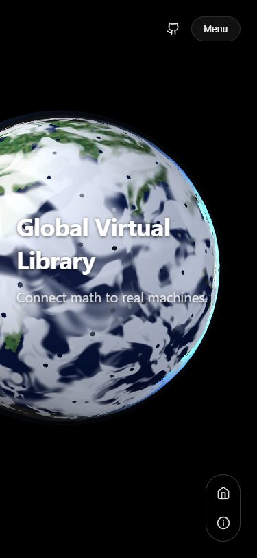
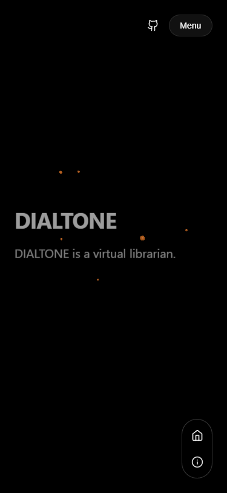
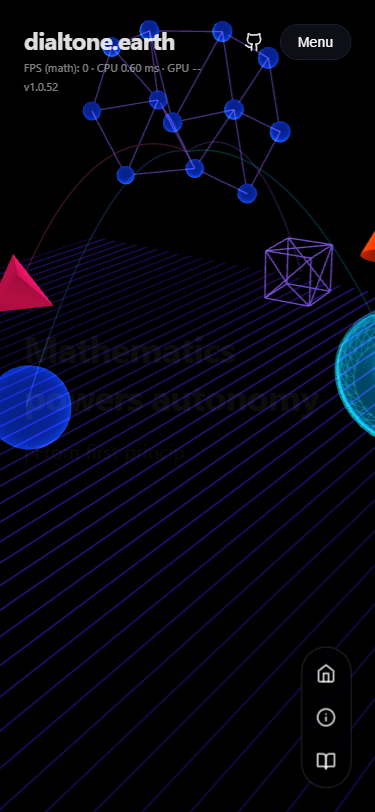
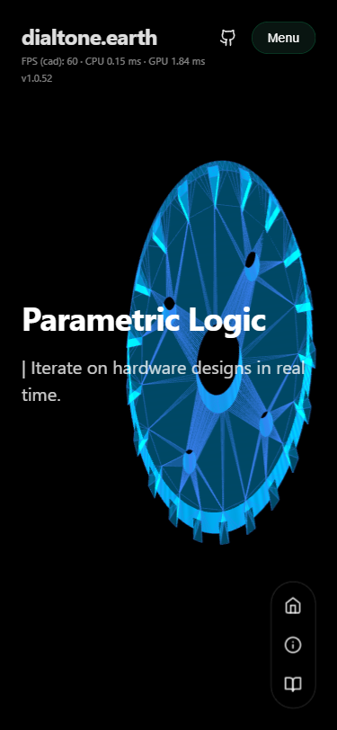
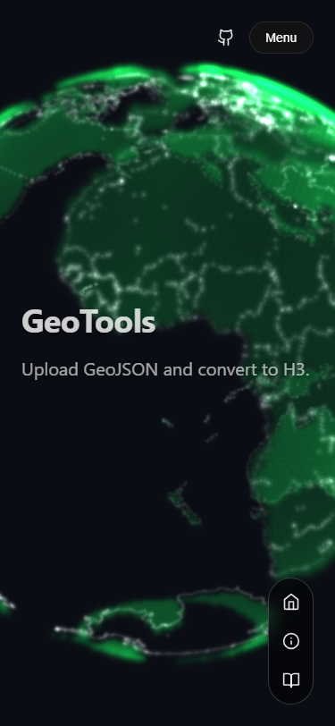
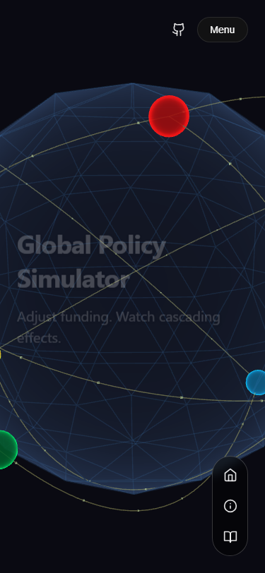
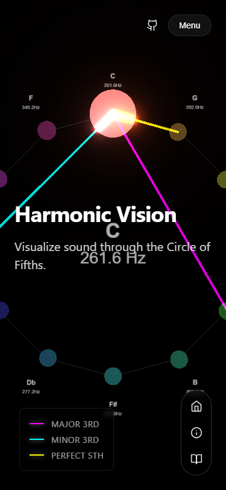

# Smoke Test Report

| Section | FPS | CPU | GPU | Heap | Net |
|---|---|---|---|---|---|
| s-home | 1 | 8.80 | 0.00 | 0.00 | 0.00 |
| s-about | 48 | 1.97 | 1.20 | 0.00 | 0.00 |
| s-robot | 7 | 0.54 | 0.59 | 0.00 | 0.00 |
| s-neural | 48 | 1.34 | 0.36 | 0.00 | 0.00 |
| s-math | 49 | 0.92 | 0.39 | 0.00 | 0.00 |
| s-cad | 50 | 0.52 | 0.39 | 0.00 | 0.00 |
| s-radio | 48 | 0.42 | 0.51 | 0.00 | 0.00 |
| s-geotools | 42 | 23.93 | 3.11 | 0.00 | 0.00 |
| s-policy | 50 | 0.68 | 0.32 | 0.00 | 0.00 |
| s-music | 49 | 0.88 | 1.46 | 0.00 | 0.00 |
| s-vision | 48 | 0.81 | 1.10 | 0.00 | 0.00 |

## Visual Summary Grid

## Section Screenshots

### s-home

### s-about

### s-robot

### s-neural

### s-math

### s-cad

### s-radio

### s-geotools

### s-policy

### s-music

### s-vision

