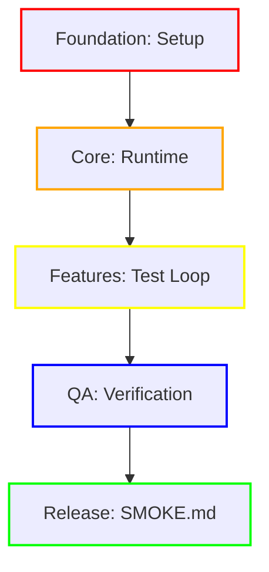

# SMOKE.md Reporting Standard

This document defines the standardized visual reporting format for Dialtone plugin smoke tests.

## 1. Overview
The `SMOKE.md` file is an automatically generated report that provides a high-level summary of test execution, performance metrics, and visual evidence. It is designed to be easily readable by humans and parseable by other LLM agents.

## 2. Mandatory Sections

### 1. Expected Errors (Proof of Life)
A dedicated section to prove the logging pipeline is active.
- **Trigger**: Intentionally triggered at the start of every smoke run.
- **Content**: Must include one Go-level message and one Browser-level console error, both prefixed with `[PROOFOFLIFE]`.
- **Purpose**: Definitive evidence that the CDP listener and Go logging pipeline are correctly capturing issues.

### 2. Real Errors & Warnings
A list of actual issues found during the test, formatted for readability.
- **Format**: Use markdown code blocks (```) for each unique error.
- **Content**: Include the error message and the full stack trace inside the code block.
- **Deduplication**: Group similar errors by message to avoid clutter.
- **Sources**: Must include both browser console logs (via CDP) and Go runtime errors.

### 2. Performance Benchmarks
A table documenting resource usage for each test section.
- **Requirements**: Must include `JS Heap (MB)` and `Resources (MB)` (network transfer).
- **Status**: A quick-glance status indicator (e.g., ✅ OK, ⚠️ BRAKED, ❌ CRITICAL).

### 4. Orchestration DAG
A Mermaid diagram representing the test lifecycle layers.
- **Layer Legend**: Every report must include a legend table mapping layers to colors and descriptions.
- **Styling**: Use `classDef` to apply colors to nodes based on their architectural layer.

#### Example Legend & DAG:

| Layer | Color | Description |
|---|---|---|
| **1. Foundation** | <span style="color:red">█</span> Red | Setup and foundation logic. |
| **2. Core Logic** | <span style="color:orange">█</span> Orange | Core engine and browser runtime. |
| **3. Features** | <span style="color:yellow">█</span> Yellow | Feature-specific navigation and metrics. |
| **4. QA** | <span style="color:blue">█</span> Blue | Screenshot capture and verification. |
| **5. Release** | <span style="color:green">█</span> Green | Final report and cleanup. |


