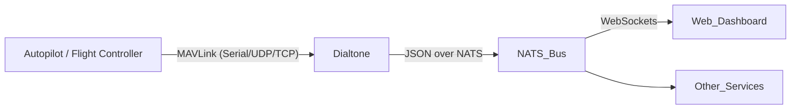

# MAVLink Integration

Dialtone includes a built-in MAVLink bridge that allows it to communicate with MAVLink-compatible autopilots (like ArduPilot or PX4). Currently, the integration focuses on monitoring system heartbeats and broadcasting them over the NATS message bus.

## Architecture

The MAVLink service runs as a subsystem within the Dialtone binary. It connects to a MAVLink source, decodes messages, and republishes relevant data to NATS subjects. This allows any NATS client (including the Web UI) to consume telemetry in real-time.



## Configuration

To enable MAVLink support, you must provide a connection string.

### Connection Strings
Dialtone supports the following connection types (powered by `gomavlib`):

- **Serial**: `serial:/dev/ttyAMA0:57600` (Device path : Baud rate)
- **UDP Server**: `udp:0.0.0.0:14550` (Listens for incoming packets)
- **TCP Client**: `tcp:127.0.0.1:5760` (Connects to a TCP server, e.g., SITL)

### Deployment (.env)
For remote deployment, set the `MAVLINK_ENDPOINT` variable in your `.env` file:

```bash
# .env
MAVLINK_ENDPOINT=serial:/dev/ttyAMA0:57600
```

This is automatically picked up by the `dialtone deploy` command, which passes it as a flag to the remote instance.

### CLI Usage
You can also run it manually via the CLI:

```bash
# Run locally with a UDP listener
./dialtone start -mavlink udp:0.0.0.0:14550
```

## NATS API

### Heartbeat
- **Subject**: `mavlink.heartbeat`
- **Direction**: Publish (Dialtone -> NATS)
- **Payload**: JSON

```json
{
  "type": "HEARTBEAT",
  "mav_type": 10,               // MAV_TYPE (e.g., 10 = Ground Rover)
  "autopilot": 3,               // MAV_AUTOPILOT (e.g., 3 = ArduPilot)
  "base_mode": 192,             // Bitmap of enabled modes
  "custom_mode": 4,             // Vehicle-specific mode (e.g., HOLD, AUTO)
  "system_status": 4,           // MAV_STATE (e.g., 4 = Active)
  "timestamp": 1705512345       // Unix timestamp
}
```

## Development

The MAVLink service is located in `src/mavlink.go`.

### Adding New Messages
To support more messages (e.g., ATTITUDE or GLOBAL_POSITION_INT):

1.  **Update `MavlinkService`**: Modify the event loop in `src/mavlink.go` to listen for the specific `gomavlib` message type.
2.  **Define Callback**: Ensure the `Callback` function in `src/dialtone.go` handles the new message type.
3.  **Publish**: Marshal the data to JSON and publish to a new NATS subject (e.g., `mavlink.attitude`).

### Testing
You can use `mavproxy.py` or the provided `mavlink/rover.py` script to simulate a MAVLink source during development.

```bash
# Start a simulated rover broadcasting to UDP localhost
python mavlink/rover.py --mock --connection udpin:127.0.0.1:14550
```
