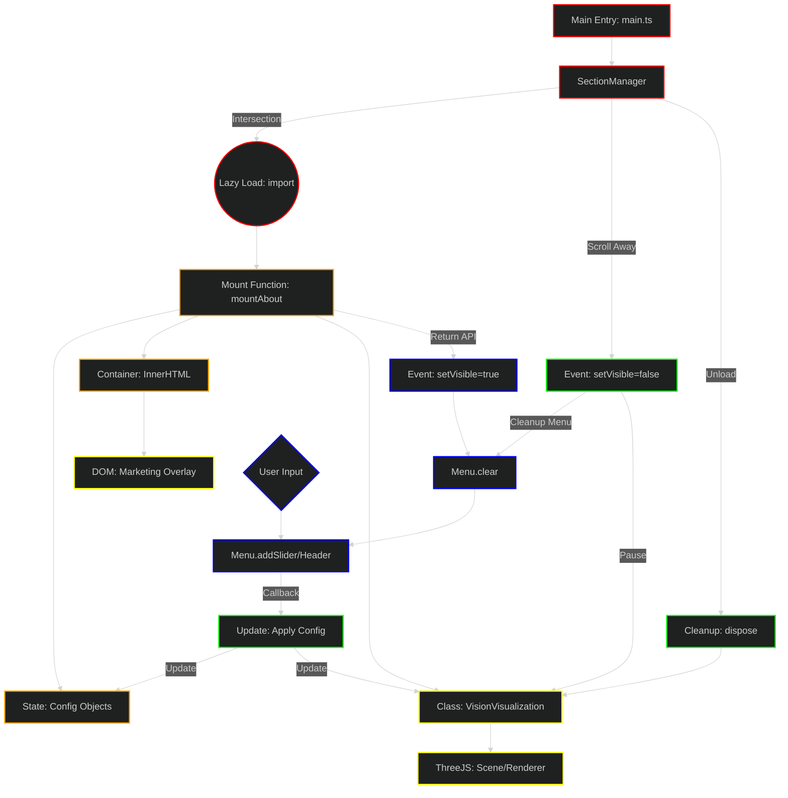

# WWW Component Architecture DAG

This document visualizes the standard architecture for `www` app components, detailing the lifecycle from the main router down to individual visualizations and menu integration.

## Legend
| Layer | Color | Description |
|---|---|---|
| **1. Foundation** | <span style="color:red">█</span> Red | The Application Entry and Section Manager (Router/Loader). |
| **2. Core Logic** | <span style="color:orange">█</span> Orange | The Component Factory (`mountX`) and State/Config definitions. |
| **3. Features** | <span style="color:yellow">█</span> Yellow | The Concrete Implementation (Three.js Viz, DOM Overlay). |
| **4. QA/Interact** | <span style="color:blue">█</span> Blue | User Interactivity via the Global Menu System. |
| **5. Release** | <span style="color:green">█</span> Green | Lifecycle Management (Visibility, Disposal, Cleanup). |



## Component Pattern Implementation

### 1. The Mount Function (Factory)
Every component exports a `mountX(container)` function. This acts as a closure that holds the component's **Configuration State** (e.g., `lightConfig`, `motionConfig`). This state is shared between the Visualization and the Menu.

### 2. The Visualization Class
The heavy lifting (Three.js, WebGL) happens in a dedicated class (e.g., `VisionVisualization`). It is initialized by the Mount function and exposes public methods (setters) to modify its behavior in real-time.

### 3. The Menu Integration
The menu is **rebuilt** every time the section becomes visible (`setVisible(true)`).
- `Menu.getInstance().clear()` is called to remove controls from the previous section.
- Sliders and inputs are added that directly modify the **Shared Config State** and call setters on the **Visualization Class**.
- When the section becomes hidden (`setVisible(false)`), the menu cleanup function is called (typically just clearing the menu again or stopping intervals).

### 4. Lifecycle API
The `mountX` function returns a standardized API object expected by `SectionManager`:
```typescript
{
    dispose: () => void;      // Full teardown (remove DOM, dispose WebGL)
    setVisible: (v: boolean) => void; // Toggle rendering/animation loop & Rebuild/Clear Menu
}
```
