# Smoke Test Orchestration DAG

This document visualizes the `www` plugin smoke test architecture, detailing the flow from Go-based orchestration to Browser-based verification.

```mermaid
graph TD
    %% Global Styling
    classDef foundation fill:#fecaca,stroke:#b91c1c,color:#7f1d1d;
    classDef core fill:#fed7aa,stroke:#c2410c,color:#7c2d12;
    classDef features fill:#fef08a,stroke:#a16207,color:#713f12;
    classDef qa fill:#bfdbfe,stroke:#1d4ed8,color:#1e3a8a;
    classDef release fill:#bbf7d0,stroke:#15803d,color:#14532d;

    %% 1. Foundation Layer (Setup)
    subgraph Foundation ["1. Foundation (Go Setup)"]
        F1("🚀 START: RunWwwSmoke")
        F2{"Check Dirs & Scripts"}
        F3["Clean Screenshots Dir"]
        
        F1 --> F2
        F2 -->|OK| F3
    end

    %% 2. Core Logic (Runtime Environment)
    subgraph Core ["2. Core Logic (Runtime)"]
        C1{"Port 5173 Open?"}
        C2["Run: npm run dev"]
        C3["Launch Headless Chrome"]
        C4["CDP: ListenTarget (console/log)"]
        
        F3 --> C1
        C1 -->|No| C2
        C2 --> C3
        C1 -->|Yes| C3
        C3 --> C4
    end

    %% 3. Features (Navigation & Interaction)
    subgraph Features ["3. Features (Test Loop)"]
        FE1["Fetch Section IDs"]
        FE2["Navigate: Base URL"]
        FE3["💥 Trigger PROOFOFLIFE Errors"]
        FE4("Loop: Each Section")
        
        FE5["Nav: window.location.hash = #id"]
        FE6["Wait: 500ms"]
        FE7["Action: ScrollIntoView"]
        FE8["Wait: 1500ms"]
        
        C4 --> FE1
        FE1 --> FE2
        FE2 --> FE3
        FE3 --> FE4
        
        FE4 --> FE5
        FE5 --> FE6
        FE6 --> FE7
        FE7 --> FE8
    end

    %% 4. QA (Verification & Capture)
    subgraph QA ["4. QA (Verification)"]
        Q1["Eval: Get Metrics (Heap/Net)"]
        Q2["📸 CDP: Screenshot"]
        Q3["Verify: Current Hash & ScrollY"]
        Q4["Log: 'SWAP' & 'SCREENSHOT STARTING'"]
        
        FE8 --> Q1
        Q1 --> Q4
        Q4 --> Q2
        Q2 --> Q3
        Q3 -->|Next Section| FE4
    end

    %% 5. Release (Reporting)
    subgraph Release ["5. Release (Reporting)"]
        R1["Filter Logs (Exclude CAD/Info)"]
        R2["Generate: SMOKE.md"]
        R3["Tile: summary.png"]
        R4("🏁 END: Pass/Fail")
        
        Q3 -->|Loop Done| R1
        R1 --> R2
        R2 --> R3
        R3 --> R4
    end

    %% Styling Application
    class F1,F2,F3 foundation;
    class C1,C2,C3,C4 core;
    class FE1,FE2,FE3,FE4,FE5,FE6,FE7,FE8 features;
    class Q1,Q2,Q3,Q4 qa;
    class R1,R2,R3,R4 release;
```

## Description of Layers

| Layer | Color | Description |
|---|---|---|
| **1. Foundation** | █ Red | Initialization of the test environment (directories, cleanups). |
| **2. Core Logic** | █ Orange | preparing the runtime (Dev Server, Browser, Websocket connection). |
| **3. Features** | █ Yellow | The active test loop controlling the browser navigation. |
| **4. QA** | █ Blue | Data capture, verification, and visual evidence collection. |
| **5. Release** | █ Green | Processing results into human-readable reports and final status. |
